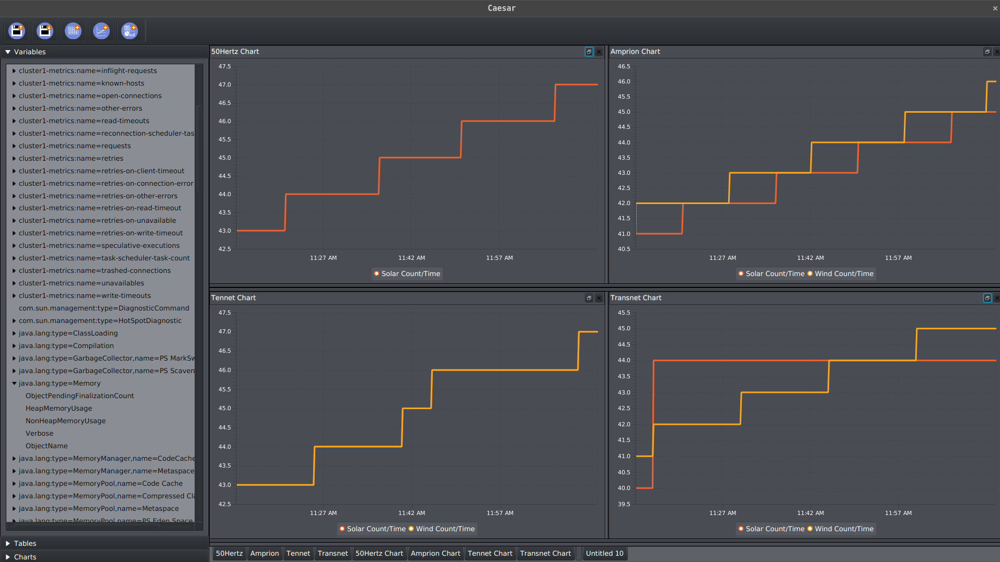

# Caesar
Caesar is a **work in progress** JMX client, capable of rendering charts from your JMX attributes.

## Description
JMX (Java Management Extensions) is a framework built-in to java. It allows you to register your objects to a JMX server.
A client may then connect to the server and inspect the object. An object may expose 3 things: attributes, operations and notifications.

With caesar, you connect to a java process, either remote or local, and you create tables from the attributes that you're interested in.
The table will then start updating itself, continually pulling the latest attributes.

You then create a chart and select wich table columns should go to which axis. Caesar will look at the data that you're adding to the graph and render them for you.

You can then also create a dashboard, which is a collection of charts, tables, and/or variables.

Everything can be saved and loaded up later.

## Features
 - [x] Save/load
 - [x] Create tables from attributes
 - [x] Create charts from tables
 - [ ] Create dashboards
 - [ ] Create buttons (operations)
 - [ ] Support notifications
 - [ ] Pie chart
 - [ ] Area chart
 - [ ] Stacked Area chart
 - [ ] Scatter chart
 - [ ] More charts?
 - [ ] More column operations
